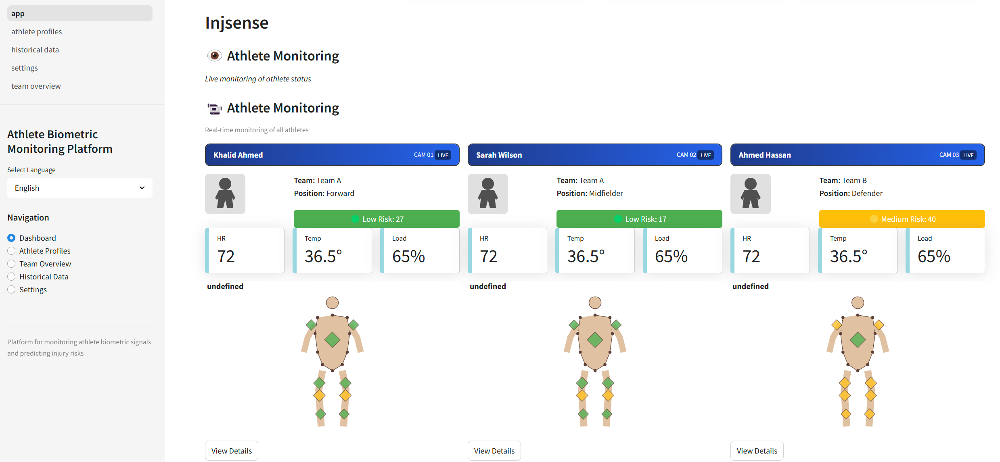

# Athlete Biometric Monitoring Platform

A comprehensive data visualization platform for athlete health monitoring that leverages machine learning to predict and mitigate injury risks.

## Features

- **Real-time Biometric Monitoring**: Visualize sEMG, temperature, and other vital athlete data in real-time
- **Injury Risk Prediction**: ML-powered analysis to predict potential injuries before they occur
- **Interactive Body Diagrams**: Visual representation of muscle stress and injury risk
- **Team Overview**: CCTV-style monitoring view for all athletes with risk indicators
- **Historical Data Analysis**: Track athlete performance and biometric trends over time
- **Multilingual Support**: Interface available in multiple languages (English, Arabic)
- **Personalized Training Recommendations**: Customized training plans based on athlete risk profiles

## Screenshots



## Technologies Used

- **Streamlit**: Interactive web application framework
- **Pandas & NumPy**: Data processing and analysis
- **Plotly**: Interactive data visualization
- **Scikit-learn**: Machine learning for risk prediction
- **JobLib**: Model persistence

## Installation

### Prerequisites

- Python 3.9 or higher
- pip (Python package manager)

### Steps

1. Clone the repository:
   ```bash
   git clone https://github.com/SennirMan/InjSense.git
   cd InjSense
   ```

2. Install required dependencies:
   ```bash
   pip install streamlit pandas numpy plotly scikit-learn scipy joblib pytz streamlit-extras
   ```

   Alternatively, if you prefer using a virtual environment (recommended):
   ```bash
   python -m venv venv
   source venv/bin/activate  # On Windows: venv\Scripts\activate
   pip install streamlit pandas numpy plotly scikit-learn scipy joblib pytz streamlit-extras
   ```

## Running the Application

### Standard Method

Run the application on localhost (127.0.0.1) with the following command:

```bash
streamlit run app.py --server.address 127.0.0.1 --server.port 5000
```

The application will be accessible at: http://127.0.0.1:5000

### Configuration File Method

The application includes a `.streamlit/config.toml` file which is already configured to run on localhost:

```toml
[server]
headless = true
address = "127.0.0.1"
port = 5000
```

With this configuration in place, you can simply run:

```bash
streamlit run app.py
```

## System Architecture

The platform consists of several interconnected components:

1. **Data Processing Pipeline**: Processes raw biometric signals
2. **Machine Learning Model**: Analyzes patterns to predict injury risks
3. **Visualization Engine**: Renders interactive body diagrams and charts
4. **Multi-page Interface**: Provides different views for athletes, teams, and historical data

## Pages

- **Dashboard**: Main CCTV-style monitoring view of all athletes
- **Athlete Profiles**: Detailed view of individual athlete data
- **Team Overview**: Comparative analysis of all team members
- **Historical Data**: Trend analysis and performance over time
- **Settings**: Configuration options including language preferences

## Data Privacy

- This application processes sensitive biometric data
- Ensure proper data handling procedures are followed
- Use secure connections when deploying in production environments


## Contact

For questions or support, please contact alawfi.y.abdullah@gmail.com